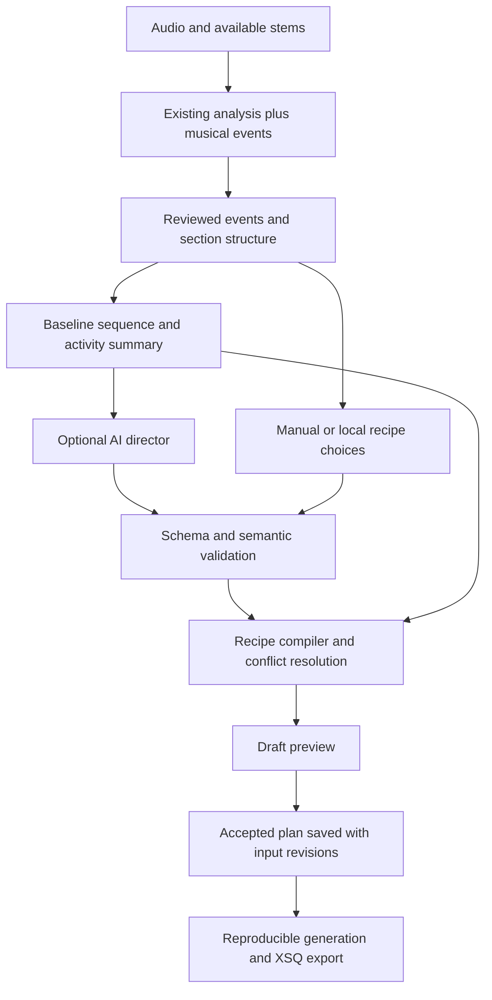

# AI Highlights — implementation and progress tracker

Created: **2026-10-08**  
Last updated: **2026-10-08**  
Current state: **Live context validation and enabled saved-plan export are implemented; public plan acceptance, preview and rendering remain pending.**  
Next task: **P4.4 public draft/acceptance workflow using the real export context, then preview/cache integration and a real render.**

## 1. What we are building

Add an optional musical-highlights workflow to xLightsAI that recognizes exceptional sounds and uses an AI lighting director to choreograph them. It should also give repeated choruses a recognizable visual identity that develops across the song.

The motivating example is `bum tam bum tam → shhhhhh → bum tam`: keep the ordinary rhythm readable, make room for the unusual sound, follow its shape with a sweep or wash, and resolve into the next beat. A highlight may begin between beats and last several seconds. More effects are useful only when they make the music clearer.

The intended workflow is:

1. Analyze the full mix and available stems for precisely timed musical events.
2. Review candidate highlights, correcting or adding moments when needed.
3. Build the existing baseline sequence and summarize its activity.
4. Ask an AI model to select events and propose treatments using supported recipes.
5. Validate and compile the proposal into normal generator placements and controlled background changes.
6. Preview, accept, save, and export the result; reuse saved choices across sessions.

**First usable milestone:** one manually marked “shhh” becomes a visible sweep with a matching return to the rhythm in a real xLights render. This proves the event-to-render path before investing in broad detection or API integration.

**Core release:** automatic candidates, manual corrections, optional API-backed direction, preview and acceptance, saved plans, chorus development, and a verified export workflow.

**Optional follow-up:** audio-model review of ambiguous excerpts, justified by measured improvement over the core release.

## 2. How to use this tracker across days

- Select a task by its stable ID, such as **P4.2**. Check its dependencies before starting.
- Work in small slices. A phase can take several sessions; no calendar deadline is assumed.
- Use `[ ]` for incomplete and `[x]` only when the task's acceptance condition has evidence. Keep partly completed tasks unchecked and describe the remainder in the handoff.
- Update the dashboard, evidence log, and next-session handoff at the end of every session.
- Record changed paths, exact verification commands, outcomes, artifact locations, and remaining limitations. Distinguish tests that passed from tests that were not run.
- Re-read relevant code when resuming. The repository map below is a starting point, not a permanent statement about future implementation.
- Read applicable repository instructions and honor approvals already given in the conversation. [CLAUDE.md](CLAUDE.md#design-first-gate) describes the repository's design process for nontrivial code changes. This tracker is a roadmap; it does not claim that future phase designs have been reviewed or implemented.
- `CLAUDE.md` references `.wolf/OPENWOLF.md`, `.wolf/anatomy.md`, `.wolf/cerebrum.md`, and `.wolf/buglog.json`. They were unavailable in this checkout during planning. Check again in future sessions and record unavailable historical evidence honestly.

### Dashboard

| Phase | Outcome | Prerequisites | Status | Completion evidence |
|---|---|---|---|---|
| P0 | Benchmark and concrete design | None | In progress | Design and protocol complete; four pending listening worksheets and native baseline captured |
| P1 | Versioned events, plans, and persistence contracts | P0 | In progress | Immutable records, atomic sidecars, and synthetic fixtures tested; broader contracts/bundles pending |
| P2 | General musical-event detection | P1 | Not started | — |
| P3 | Reviewed events and persistent user edits | P1 | In progress | Storage and manual-event API tested; compiler handoff, reconciliation, and UI pending |
| P4 | Recipe compiler and local highlight generation | P1; P3.1 for manual events | In progress | Two recipes and live context/export replay tested; public acceptance, preview, broader composition and render pending |
| P5 | Optional provider client and request lifecycle | P1 | Not started | — |
| P6 | AI lighting director and validated proposals | P2–P5 | Not started | — |
| P7 | Complete review, preview, and export UI | P3–P6 | Not started | — |
| P8 | Chorus motifs and development across sections | P6–P7 | Not started | — |
| P9 | Quality evaluation and release readiness | P2–P8 | Not started | — |
| P10 | Optional audio-model review | P9 | Deferred | — |

Recommended work order: **P0 → P1 → P3.1 → P4.1–P4.2 → first render → P2 → remaining P3/P4 → P5 → P6 → P7 → P8 → P9**. P10 is a later decision. Integration testing starts with the first slice rather than waiting for P9.

### Preparation already completed

- [x] Inspect current analysis, story, generation, export, settings, and session-storage entry points.
- [x] Create this tracker with implementation tasks, acceptance criteria, and session handoff templates.

## 3. Current repository foundations

These observations come from source inspection on 2026-10-08, not from a new listening or rendering evaluation.

| Area | Existing entry points | Implication for this project |
|---|---|---|
| Analysis result and cache | [result.py](src/analyzer/result.py), [orchestrator.py](src/analyzer/orchestrator.py) | `HierarchyResult` already carries energy events, crash accents, fills, beats, sections, and stem curves. Preserve old-data loading while versioning new results. |
| Specialized detectors | [crash_accents.py](src/analyzer/crash_accents.py), [riff_bursts.py](src/analyzer/riff_bursts.py), [kick_pulses.py](src/analyzer/kick_pulses.py) | Reuse their evidence. A missing specialized stem currently prevents some detections; a broad “shhh” may be outside their scope. |
| Song moments | [moment_classifier.py](src/story/moment_classifier.py), [builder.py](src/story/builder.py) | The classifier currently emits energy surges/drops, silence, and vocal entries/exits. Extra names in its type-weight table do not mean those detectors exist. |
| Moment ranking | [moment_classifier.py](src/story/moment_classifier.py) | Ranking currently sorts primarily by intensity. Its pattern/boundary score is secondary. Perceptual importance needs explicit evaluation. |
| Section structure | [section_classifier.py](src/story/section_classifier.py), [self_similarity.py](src/analyzer/self_similarity.py) | Existing chorus heuristics and repetition evidence can support recurring visual motifs. Treat uncertain roles as uncertain. |
| Generator | [plan.py](src/generator/plan.py), [models.py](src/generator/models.py), [effect_placer.py](src/generator/effect_placer.py) | Extend the existing plan and placements. `GenerationConfig` has accent flags and `SequencePlan` has song-level effect collections. |
| Effect vocabulary | [effects](src/effects), [variants](src/variants), [themes](src/themes) | Compile approved recipes using real catalog entries, prop suitability, and the user's themes. |
| Validation and XML | [plan_validator.py](src/generator/plan_validator.py), [xsq_writer.py](src/generator/xsq_writer.py) | The current plan validator checks a narrow monotony case. It is not yet a full validator for AI plans, collisions, or density. |
| Export path | [export.py](src/review/api/v1/export.py), [generator_runner.py](src/evaluation/generator_runner.py) | Trace the actual UI → runner → `GenerationConfig` → `build_plan` → writer path. Also inspect [generate_routes.py](src/review/generate_routes.py) and active CLI callers. |
| Timeline | [Timeline.tsx](src/review/frontend/src/screens/Timeline.tsx), [DetectorTracks.tsx](src/review/frontend/src/components/DetectorTracks/DetectorTracks.tsx) | Extend established timeline and playback interactions. |
| User state | [assignments.py](src/review/storage/assignments.py), [paths.py](src/review/storage/paths.py), [bundle.py](src/review/storage/bundle.py) | Preserve existing session fields, use the state directory, and include accepted highlights in portable backups. |
| Settings | [settings.py](src/settings.py), [docker-compose.yml](docker-compose.yml) | Add nonsecret AI settings and a backend credential mechanism compatible with Docker. |
| Quality tools | [evaluation](src/evaluation), [microscope](src/microscope), [tests](tests) | Reuse existing timing, restraint, suitability, and render checks; add highlight-specific evidence. |

Read the detector module histories before changing their behavior. They describe previous failures involving cold-open false positives, stem routing, mismatched audio caches, and verification against approximations instead of the shipped path. Reproduce relevant cases rather than treating comments as fresh validation.

Related documents: [song event design](docs/song-timeline-phase3-events.md), [event ranking](docs/song-timeline-phase5-ranking.md), [song story](docs/song-story-spec.md), [segment-classification changelog](docs/segment-classification-changelog.md), and [known test limitations](docs/known-broken-tests.md). Older designs can contain unimplemented behavior or stale assumptions; source and current measurements decide.

The [AI palette proposal](openspec/changes/theme-ai-palette-suggest/proposal.md) is prior design context, not proof that a reusable provider client is shipped. Check actual code before reusing that proposal's interfaces.

## 4. Architecture and operating rules



1. **Audio evidence owns timing.** AI references event IDs and bounded musical anchors. Preserve unsnapped event times; quantize compiled placements to the configured output frame interval only. The current default is 25 ms.
2. **Detection and selection are separate.** Detect enough candidates to review; select fewer for lighting. Detection confidence, sound intensity, and musical importance are different quantities.
3. **Sound shape matters.** Represent onset, perceptual peak, and end. Do not reduce every sweep, fill, and gap to an identical flash.
4. **AI proposes supported choreography.** Return typed plans and recipe choices. Use application code for XML, effect parameters, timing resolution, and bounds checking.
5. **Make room for highlights.** Allow controlled dimming or simplification of the background with explicit restoration. Added overlays alone may remain invisible in a busy sequence.
6. **Repetition can be musical.** A chorus motif may recur intentionally. Variation should follow song structure and reserve headroom for later climaxes.
7. **Reviewed intent survives regeneration.** Manual event corrections, rejected suggestions, locked sections, themes, and accepted plans need explicit precedence and persistence.
8. **AI is optional.** Disabled mode preserves baseline generation. Valid saved plans can be replayed without a network call. Failure to get a new proposal must not destroy an accepted plan.
9. **Reproducibility comes from saved artifacts.** Persist the accepted plan, recipe versions, relevant input hashes, and variation seed. A model seed or temperature setting alone is not a reproducibility guarantee.
10. **Measure the delivered result.** Distinguish an event being detected, selected, compiled, serialized, and visible in the xLights render.

## 5. Detailed implementation backlog

Each checkbox represents a deliverable, not just a file edit. Proposed module names below are suggestions to confirm during phase design.

### P0 — benchmark and design

Goal: define what “better” means using real musical examples and verify the integration approach.

- [ ] **P0.1 — Build a listening benchmark.**
  - **2026-10-08 progress:** Four existing CC0 recordings are hash-verified with production-loader durations, development/holdout assignments, and pending continuous-window worksheets in [the corpus](tests/fixtures/highlights/README.md). Two additional recording slots are reserved. No listening annotations are complete.
  - Select approximately 6–10 recordings covering a sweep/wash, an isolated crash, a fill, a quiet transition, repeated choruses, dense percussion, and a track with few exceptional moments. Include the user's motivating sound when an example is available.
  - Annotate source hash, recording duration, event start/peak/end, descriptive label, importance, certainty, and listening notes. Mark ordinary beats and repetitive hi-hats as negative examples. Separate “sound exists” from “deserves a highlight.”
  - **Accept when:** annotations cover continuous scored excerpts, not only handpicked positives, and include a held-out set reserved before tuning. Use synthetic or redistributable fixtures for committed audio; keep private recordings local.

- [ ] **P0.2 — Capture the existing behavior.**
  - **2026-10-08 progress:** [Native baseline captured](docs/ai-highlights/baseline-2026-10-08.md) through real import/analyze/accept/export APIs; two exports are byte-identical at seed `20261008`. Optional analysis components are unavailable. Full-capability comparison, listener-confirmed target tracing, and renders remain pending.
  - Generate baseline analysis and sequences using the actual UI/export pipeline, a fixed layout, known theme settings, and a recorded variation seed. Record available stems, schema versions, source hashes, and actual durations.
  - Collect representative renders or timestamped viewing notes. Identify which missed highlights are detection failures, selection failures, or placements hidden by other lighting.
  - **Accept when:** a later session can reproduce the baseline and trace at least one target moment through analysis to output. Do not mark a stub response or approximate detector run as end-to-end success.

- [x] **P0.3 — Write the first implementation design.**
  - **2026-10-08 progress:** [Concrete design](openspec/changes/ai-highlights-foundation/design.html), alternatives, [caller inventory](openspec/changes/ai-highlights-foundation/callers.md), historical risks, and first-slice tasks recorded. The user subsequently requested continuation; contracts/storage implemented under that authorization. Compiler and endpoint details remain work within this scoped design.
  - Specify event contracts, storage ownership, compiler insertion point, baseline-summary generation, and how highlight recipes coexist with current crash/fill accents. List touched symbols and their callers using `rg` across `src/` and `tests/`.
  - Compare at least: improved deterministic recipes alone; AI direction over structured evidence; and direct audio-model sequencing. Explain the selected hybrid and why direct model-written XSQ is excluded from the initial implementation.
  - **Accept when:** dependency order, compatibility behavior, failure handling, historical risks, and applicable design review are recorded. Resolve phase-local details before editing shared modules; this roadmap does not replace that analysis.

- [x] **P0.4 — Freeze initial evaluation criteria.**
  - **2026-10-08 progress:** [Protocol v1](docs/ai-highlights/benchmark.md) fixes matching, negative windows, holdout rules, timing/distribution thresholds, minimum sample sizes, and visual acceptance. These are targets, not measured quality results.
  - Define event matching, timing tolerances by event type, duplicate matching, negative windows, and what constitutes an audible but unimportant event. Separate candidate-recall scoring from selected-highlight precision.
  - Suggested starting hypotheses: at least 80% selected-highlight precision and 75% important-event recall on the held-out benchmark; median attack timing error at most 100 ms for sharp events. Calibrate these before tuning and report counts plus distributions, including late hits. Gradual sweeps need boundary/shape assessment rather than the same attack threshold.
  - **Accept when:** thresholds and evaluation protocol are written, with a minimum visual acceptance of “clear musical fit, visible emphasis, no distracting extra accent.” These are project targets, not current performance claims.

### P1 — data contracts and compatibility

Depends on P0. Likely touchpoints: analysis results, story serialization, generator models, session storage, and bundles.

- [ ] **P1.1 — Define a musical-event record.**
  - **2026-10-08 progress:** [Strict event records](src/highlights/models.py) preserve optional peak/evidence/scores and source identity with round-trip/range tests. Existing analysis remains unchanged; optional section/repetition references and analyzer integration remain pending.
  - Include `event_id`, source/revision identity, type, start/peak/end in milliseconds, supporting detector/stem evidence, detection score, salience score, optional section/repetition references, and provenance. Keep an `unknown_texture` option.
  - Define score scales explicitly; do not call heuristic scores calibrated probabilities. Validate finite numbers, ordered timestamps, bounds within the recording, and missing-evidence behavior.
  - **Accept when:** old analysis loads with safe defaults; new events round-trip; transient, sustained, uncertain, and empty-event examples pass meaningful contract tests. Unknown versions produce an explicit compatibility outcome.

- [ ] **P1.2 — Define reviewed-event and highlight-plan records.**
  - **2026-10-08 progress:** Immutable reviewed events, unsnapped overrides, plan snapshots, context fingerprints, bounded anchors, and provenance are implemented. Actual recipe/layout validation, chorus and background treatments, and reanalysis remapping remain pending.
  - Keep detector output separate from user acceptance/dismissal, manual timing edits, importance overrides, and locks. Use stable IDs within a revision and an explicit remapping strategy across reanalysis; ambiguous matches require review.
  - Plans reference event/section IDs, allowed recipes, eligible target roles/groups, bounded intensity, palette source, timing anchors/offsets, background treatment, and rationale. Add plan status, provenance, recipe/catalog version, and input fingerprints.
  - **Accept when:** examples represent a sweep with a subsequent impact, an ignored event, and a chorus treatment without free-form executable code, arbitrary XML, or invented model/group names.

- [ ] **P1.3 — Establish revision, cache, and persistence rules.**
  - **2026-10-08 progress:** [Sidecar storage](src/review/storage/highlights.py) uses atomic replacement and revision checks; changed context/events report stale snapshots. Existing bundles still pass their checks, but do not include highlights. Portable backup, pipeline cache integration, and migration policy remain pending.
  - Separate caches for analysis, candidate extraction, AI proposals, and compiled output. Identify keys for source content, analysis revisions, reviewed sections/events, layout membership, themes, effect/recipe catalog, prompt/schema, provider/model, user direction, and baseline seed as appropriate to each stage.
  - Store artifacts under the established state directory using atomic replacement. Include portable accepted intent in bundles; exclude credentials. Define how unavailable custom recipes/assets affect imported plans.
  - **Accept when:** changing a relevant input marks dependent plans stale; a rename alone does not change audio identity; unchanged input can reuse results; old bundles still load and new bundles preserve accepted highlights.

- [x] **P1.4 — Add an end-to-end fixture before full detection.**
  - **2026-10-08 progress:** [Synthetic full-mix fixtures](tests/fixtures/highlights/README.md#synthetic-integration-fixtures) generate rhythm → off-beat sweep → impact → quiet tail, near-end, and empty-event cases, all without stems. Hand-authored state/plan JSON round-trips, targets exist in the reference layout, and events pass through real import and manual review APIs. Generation fingerprints remain explicit synthetic placeholders; this checks inputs for the planned compiler, not actual rendering.
  - Create a small synthetic musical example containing a regular beat, a noise sweep, a following impact, and a quiet tail. Provide a hand-authored event and proposed plan as a test fixture.
  - Add a missing-stem case and a near-song-end case. Keep fixtures independent of the developer's music library, custom effects, and credentials.
  - **Accept when:** event/plan fixtures serialize, reload, and can be consumed by the planned compiler. They establish interface expectations without pretending to validate perceptual detection quality.

### P2 — general musical-event detection

Depends on P1. Proposed home: focused detector modules under `src/analyzer/`, orchestrated through the existing pipeline.

- [ ] **P2.1 — Adapt existing events into the shared representation.**
  - Map crashes, snare/kick fills, energy changes, gaps, and vocal boundaries. Retain provenance and unavailable-data flags. Do not invent a measured duration or calibrated confidence when the original mark has neither.
  - Reconcile story moments with analysis events so one physical event does not automatically become several independent lighting requests.
  - **Accept when:** current detector marks remain traceable and behavior outside the enabled feature is unchanged. Tests cover overlapping evidence and absence of specialized drum stems.

- [ ] **P2.2 — Detect locally unusual changes in sound.**
  - Evaluate features such as changes in frequency-band energy, spectral flux, spectral flatness, timbre, onset density, and stem activity. Reuse available analysis arrays where practical; record normalization and time resolution.
  - Compare against local musical context and repeated patterns. Suppress steady hi-hats, regular kick/snare alternation, and recording-start artifacts. Full-mix analysis remains available when stems are missing.
  - **Accept when:** measured candidate recall improves on the benchmark without flooding repetitive or quiet passages. Include false positives and runtime/memory cost in the report; avoid thresholds fitted to one recording.

- [ ] **P2.3 — Group candidates into shaped events.**
  - Merge adjacent frames into sustained regions and refine start, peak, and decay using the waveform or suitable feature envelope. Detect noise sweeps/washes even when they lack a sharp onset.
  - Separate a buildup/sweep from its following impact, with an optional relationship between them. Distinguish gap start from musical re-entry. Correct for known window-centering and resampling offsets.
  - **Accept when:** the motivating “shhh” has a usable interval, distinct neighboring sounds remain separate, and offsets preserve actual off-beat timing. Quantization belongs to output compilation, not detection.

- [ ] **P2.4 — Rank importance and deduplicate evidence.**
  - Evaluate rarity, contrast with neighboring bars, duration, structural role, and recurrence. Keep intensity, confidence, and salience separate so the loudest sound is not automatically the most important.
  - Fuse multiple detectors supporting the same event. Select lighting candidates after scoring; do not suppress a better event during early peak picking. Apply configurable density and spacing at selection time with explicit suppression reasons.
  - **Accept when:** an unusual softer event can outrank a routine loud beat; closely spaced distinct events can survive; repetitive passages can legitimately produce no selected highlights.

- [ ] **P2.5 — Integrate analysis, serialization, and observability.**
  - Wire events through `HierarchyResult`, the story/analysis payload, cache loading, progress reporting, and any relevant timing exports. Follow actual hierarchy cache-version rules, not only legacy `src/cache.py` behavior.
  - Expose detector version, missing stems, fallback use, candidate counts, and timing provenance. Avoid failing baseline analysis when an optional detector is unavailable.
  - **Accept when:** the real analysis path emits the new events, warm-cache results match cold-cache results, and a source/detector change invalidates the correct derived artifacts.

### P3 — review state and manual control

Depends on P1; P3.2–P3.3 should also exercise P2 output. Proposed storage/API names must follow existing conventions.

- [ ] **P3.1 — Persist manual and reviewed events.**
  - **2026-10-08 progress:** [GET/PUT manual-event endpoints](docs/ai-highlights/manual-api-2026-10-08.md) now support creation, review corrections, dismissal/restoration/removal and locks using server-verified audio identity/duration. Tests cover real import, reload, session replacement, racing writes, invalid edits, changed audio, and preserved plan snapshots. Compiler handoff, plan acceptance, and the timeline UI remain pending; this task stays open until the manual sweep reaches the compiler.
  - Implement create/update/dismiss/restore operations, timing correction, importance, and locking. Preserve unrelated session data when themes or sections are subsequently saved.
  - Require the expected revision on writes to prevent an old tab from overwriting newer edits. Manual events must support the first render milestone without automated detection or an API key.
  - **Accept when:** edits survive application restart and subsequent theme/section saves; invalid times are rejected; a fixture can create a manual sweep and pass it to the compiler.

- [ ] **P3.2 — Reconcile edits after reanalysis or section changes.**
  - Preserve user intent using source identity and an explicit event-matching policy. Keep uncertain rematches visibly unresolved rather than silently attaching a dismissal to a different sound.
  - Mark affected proposals stale after timing, section, layout, or theme changes. Specify whether locked event times stay fixed when surrounding section boundaries move.
  - **Accept when:** reanalysis, section splitting/merging, and replacement with a different recording have tested, predictable outcomes.

- [ ] **P3.3 — Provide a minimal timeline event editor.**
  - Add a highlights track using existing playback/zoom conventions. Show event extent and peak; allow listening with pre/post context, manual creation, timing adjustment, accept/dismiss, and undo.
  - Distinguish detected, manually added, dismissed, and unresolved events. Surface missing evidence in plain language.
  - **Accept when:** the user can identify and correct one missed “shhh,” reload the page, and see the same edit. Include keyboard access and tests for seek/zoom coordinate correctness.

### P4 — recipe compiler and local generation

Depends on P1 and P3.1. Prove this path before making model-generated plans a dependency.

- [ ] **P4.1 — Define a small recipe catalog.**
  - **2026-10-08 progress:** [Two initial recipes](src/generator/highlights.py) compile to real catalog `On` effects: rise/decay wash and isolated impact. Explicit target eligibility, palette inheritance, intensity/duration bounds and missing-peak behavior are tested. Three additional recipes and broader target arbitration remain pending.
  - Start with an isolated impact, sustained sweep/wash, buildup-and-release, gap-and-re-entry, and a localized fill accent. Define required event evidence, eligible prop types, intensity bounds, duration rules, and fallback targets.
  - Resolve recipes to existing effect/variant identifiers and valid parameters. Specify behavior for a display without stars, matrices, moving heads, or spatially useful groups.
  - **Accept when:** each recipe has a concrete example and can either compile for an eligible layout or explain why it is unavailable. Recipe names are application concepts, not assumed xLights effect names.

- [ ] **P4.2 — Compile a reviewed event into placements.**
  - **2026-10-08 progress:** The synthetic event/plan compiles to normal `EffectPlacement` objects, `SequencePlan.highlight_effects`, and real writer output. Saved-plan replay produces identical XSQ bytes. Source times remain intact; configured 20/25/50 ms frame intervals reach serialized output. [Artifacts and checks](docs/ai-highlights/compiler-2026-10-08.md). Enabled saved-state export now passes through the actual runner/config/build/compiler/writer path with live context validation. Public draft/acceptance API, preview and the required visual render remain pending.
  - Resolve event anchors and allowed offsets, clip to the audio bounds, quantize to `frame_interval_ms`, enforce minimum valid durations, and produce normal `EffectPlacement` objects.
  - Wire the manual-event fixture through the active export/runner/config/plan/writer path. Verify layer ordering: current code documents that lower layer numbers render in front; confirm with actual output.
  - **Accept when:** the first manually marked sweep is visible and timed correctly in an xLights render. Save the plan, XSQ, input settings, and timestamped evidence. Inspect XML as well as the visual result.

- [ ] **P4.3 — Make space for highlights and resolve conflicts.**
  - Implement bounded dimming/simplification over selected background regions, followed by exact restoration of the underlying plan. Define composition when highlights overlap or straddle section boundaries and end fades.
  - Resolve contention with existing crash/fill accents, lyrics/faces, pictures/video, and moving-head actions. Check overlapping physical model membership across groups, not just identical group names. Give user locks explicit precedence.
  - **Accept when:** a highlight stays visible over a busy baseline, duplicate accents are avoided, protected content follows the agreed policy, and brightness does not remain incorrectly reduced after the highlight.

- [ ] **P4.4 — Add semantic validation and deterministic replay.**
  - **2026-10-08 progress:** Compiler validates supplied context/reviews, real layout/catalog targets, supported recipes, bounds, palette and physical conflicts without mutating baseline/intent. Protected or ambiguous cross-group overlaps are rejected. Live context is now built from actual audio/analysis/layout/catalogs/settings/baseline in build_plan. Export rejects stale plans, preserves accepted state, rechecks request inputs before publication and retains the used layout in its package. Public acceptance, density, background restoration and preview freshness remain unfinished.
  - Validate event/group/recipe references, timestamps, numeric bounds, prop suitability, density, conflicts, and background restoration. Treat an invalid required operation as an invalid proposal; log safe optional omissions explicitly.
  - Define and enforce one policy for rejected proposals: retain the last valid accepted plan, otherwise use the baseline and report the failure. Compile an empty plan as a no-op.
  - **Accept when:** saved inputs and plans produce equivalent placements/output on repeated runs, disabled mode matches baseline, invalid plans cannot partially mutate accepted output, and validation reports actionable reasons.

### P5 — provider integration and request lifecycle

Depends on P1. Keep provider/model choice replaceable through a small interface; do not build a broad plugin framework.

- [ ] **P5.1 — Add an optional backend provider client.**
  - Select the initial provider and model using current official documentation at implementation time. Require structured plan output and benchmark quality; do not choose solely by model size or claimed creativity.
  - Implement one client interface with a deterministic fake for tests. Verify SDK/runtime compatibility before adding dependencies. Document installation for the project's Docker workflow.
  - **Accept when:** valid responses parse into the agreed schema, refusal/incomplete/malformed responses are distinguishable, and core generation imports and runs without an API key or optional client dependency.

- [ ] **P5.2 — Configure credentials and nonsecret settings.**
  - Read the API key in the backend from an environment variable or suitable credential store. Store provider, model, enabled state, and usage preferences separately from secrets. Pass credentials into Docker without committing them.
  - Return only configured/unconfigured status to the browser. Redact secrets from logs/errors and exclude them from plans, bundles, fixtures, and version control.
  - **Accept when:** an intentional test request can authenticate, missing/invalid credentials produce clear UI states, and serialization tests show that keys never enter saved song data.

- [ ] **P5.3 — Implement bounded background jobs.**
  - Use the existing background-job conventions for generation/progress. Add explicit job states, timeout handling, bounded retries for transient failures, duplicate-request suppression, and cancellation of local processing.
  - Capture immutable input revisions when starting a request; a late response for an edited song becomes stale. Document that cancelling locally may not cancel an already submitted provider request or its cost.
  - **Accept when:** timeout, rate limit, authentication failure, cancellation, server restart, and a late response leave accepted state intact. No endless retries or silent duplicate paid requests occur.

- [ ] **P5.4 — Add cost visibility, cache reuse, and request limits.**
  - Bound the context, output size, request count, and retry count. Record available token/usage data and distinguish measured usage from estimates. Use current pricing only when a cost estimate is displayed.
  - Reuse proposals by relevant input fingerprint and allow explicit regeneration. Exporting an accepted plan must not issue a fresh model request. State exactly what data is sent; the initial director receives structured data rather than source audio.
  - **Accept when:** repeated preview/export reuses the accepted plan, configured local limits prevent starting excess work, and cache invalidation is verified. Treat provider billing limits as separate from application estimates.

### P6 — AI lighting director

Depends on P2–P5. Proposed home: a focused `src/director/` package, with location confirmed in the phase design.

- [ ] **P6.1 — Build a compact, grounded song brief.**
  - Include reviewed sections/repetition, event IDs and shapes, measured evidence, selected themes, target capabilities, available recipes, user locks, and a summary of baseline activity around candidates.
  - Include enough whole-song context to allocate emphasis across sections. Bound long-song context using summaries or hierarchical planning; retain the IDs needed to compile choices.
  - **Accept when:** a captured request explains both why an event is special and what lighting is already present. Candidate coverage and omissions are inspectable; no timing or instrumentation is invented during summarization.

- [ ] **P6.2 — Generate structured choreography proposals.**
  - Prompt for selective emphasis, deliberate restraint, coherent palettes, and event-shape matching. Permit no highlight when evidence is weak. Allow user direction such as “subtle,” “dramatic,” or “emphasize transitions.”
  - Constrain choices to valid recipes and target roles, with event-relative timing. Require concise reasons linked to supplied evidence. Use one planning request initially; add another critique pass only if evaluation justifies it.
  - **Accept when:** mocked and sampled real responses cover a sweep, fill, silence/re-entry, and empty proposal without arbitrary XML or unsupported effects. Store prompt and schema versions with proposals.

- [ ] **P6.3 — Validate the whole proposal before compilation.**
  - Combine schema checks with P4 semantic validation and stale-input checks. JSON schema compliance does not prove musical correctness. Reject unknown IDs, impossible offsets, fabricated targets, excessive activity, and edits to locked choices.
  - Permit only a bounded repair attempt with concrete validation errors if useful; otherwise retain the existing accepted plan. Treat song metadata, lyrics, and user-facing descriptions as data, not instructions that can override the plan contract.
  - **Accept when:** adversarial fixtures cannot exceed constraints or corrupt state, and a failed repair ends in a visible recoverable outcome.

- [ ] **P6.4 — Save proposals, revisions, and decisions.**
  - Persist draft/rejected/accepted/superseded states, provenance, request input fingerprints, validation result, and chosen variation seed. Support event-level locks and selective regeneration without changing locked treatments.
  - Store a useful bounded audit summary; never label a saved plan “accepted” merely because the API returned successfully.
  - **Accept when:** restarting the application preserves accepted work, a new draft can be discarded, and replay works with the provider offline.

### P7 — review, preview, and export experience

Depends on P3–P6. Extend the minimal editor from P3.3 rather than building a separate timeline system.

- [ ] **P7.1 — Add the AI Highlights controls.**
  - Provide explicit proposal generation, density/intensity preferences, optional direction text, progress, and clear unavailable/error/stale states. Reuse existing design tokens and interaction patterns.
  - Explain the proposed visual action in musical language. Distinguish an event's detection certainty from its proposed importance and treatment.
  - **Accept when:** the user can request a draft, understand each suggested highlight, and dismiss weak suggestions without opening JSON files.

- [ ] **P7.2 — Compare baseline and enhanced previews.**
  - Add A/B playback for the same audio time, layout, themes, and seed. Include pre-event context so dimming and recovery can be assessed. Show planned intervals and target props.
  - Clearly identify approximated browser previews. Use actual xLights rendering for final blend/layer evaluation; the browser preview alone is insufficient evidence of the exported appearance.
  - **Accept when:** the user can compare the motivating “shhh,” seek directly to it, and verify both its buildup and the return to the rhythm.

- [ ] **P7.3 — Apply, lock, undo, and regenerate.**
  - Support accepting individual treatments or the full draft, adjusting recipe/intensity/targets within valid ranges, locking favorites, undoing edits, and regenerating unlocked suggestions.
  - Require a fresh validation against current input revisions when applying. Warn about stale drafts with a clear replan/review action instead of silently applying them.
  - **Accept when:** editing a theme or section while an AI job runs cannot overwrite newer work, and accepted decisions survive reload and later exports.

- [ ] **P7.4 — Complete export and backup plumbing.**
  - Pass the accepted plan through all supported generation callers; either support a caller explicitly or document its limitation. Preserve feature flags and existing user overrides.
  - Include accepted highlight intent and necessary version metadata in backup bundles; verify XSQ package targets against the paired layout. Report intentional fallback when an accepted plan cannot be used.
  - **Accept when:** UI review → accept → save → restart → export → open/render in xLights works, and a bundle round-trip preserves the decisions without any credentials.

### P8 — chorus motifs and whole-song development

Depends on P6–P7. Keep section detection improvements distinct from visual treatment changes.

- [ ] **P8.1 — Reconcile repeated sections and chorus identity.**
  - Combine reviewed section roles with repetition evidence and expose uncertainty. Respect a manually corrected chorus label; do not force the loudest or most repeated instrumental passage to be a chorus.
  - Define stable repetition-group references for plans and behavior for songs without repeated sections. Inspect current story validation before changing classifier semantics.
  - **Accept when:** reviewed choruses map to the intended occurrences, uncertain groups remain editable, and any section-detection/classification change is appended to [the required changelog](docs/segment-classification-changelog.md).

- [ ] **P8.2 — Plan motifs and controlled escalation.**
  - Define a recurring palette/movement/prop-role motif. Vary a small number of dimensions per occurrence: spatial coverage, texture, brightness, motion, or accent density.
  - Reserve headroom where the arrangement builds. Allow a quieter final chorus when the recording calls for it; occurrence number alone must not force escalation. Connect pre-chorus tension, chorus arrival, and recovery.
  - **Accept when:** rendered repeated choruses are recognizably related, meaningful differences follow the music, and transitions remain readable.

- [ ] **P8.3 — Compose section treatments with local highlights.**
  - Apply whole-song activity budgets and precedence between motifs, event treatments, existing accents, and locks. Avoid having a chorus arrival receive several competing whole-display impacts.
  - Verify plan regeneration after section timing edits and no-chorus/no-repeat songs.
  - **Accept when:** a chorus with an embedded “shhh” retains both its motif and a visible local highlight, with no event duplicated through separate planning paths.

### P9 — evaluation and release

Depends on the core phases. Run focused verification throughout development; this phase consolidates evidence.

- [ ] **P9.1 — Evaluate detection and selection on held-out audio.**
  - Report per-type candidate recall, selected-highlight precision/recall, duplicate rate, false highlights per minute, timing-error distributions, and fallback behavior. Match detections to annotations one-to-one using the frozen protocol.
  - Include sparse-event, dense-percussion, stem-unavailable, different-recording, and long-song cases. Record misses and listening disagreements rather than silently relabeling the benchmark after seeing outputs.
  - **Accept when:** results meet the agreed P0.4 criteria or clearly identify a scoped limitation and remediation task. Preserve the same benchmark split when comparing iterations.

- [ ] **P9.2 — Evaluate visible musical improvement.**
  - Compare baseline, local recipes, and AI-directed plans using identical recordings/layouts/seeds. Score musical fit, visibility, timing, restraint, motif coherence, and distraction; randomize presentation order where practical.
  - Inspect real rendered excerpts for occlusion, layer order, buildup/decay shape, recovery, and physical group overlap. Automated density and variety metrics are supporting evidence, not the sole definition of quality.
  - **Accept when:** the report includes concrete timestamps and artifacts demonstrating improvement, plus at least the sparse-event and busy-section negative cases.

- [ ] **P9.3 — Run regression and failure-path checks.**
  - Cover disabled mode, no candidates, empty proposal, absent stems, invalid/expired credentials, timeout, rate limit, malformed/refused response, stale revisions, overlapping events, no eligible props, corrupted cache, and old bundles.
  - Run the relevant existing analyzer/generator/storage/API/UI suites and repository acceptance checks. Record environmental blockers separately from failures; do not rewrite baselines solely to make a failing test pass.
  - **Accept when:** required checks pass, known limitations have evidence, and no unrelated test is silently skipped or quarantined.

- [ ] **P9.4 — Document and package the usable workflow.**
  - Update the maintained README workflow with setup, backend key configuration, what is sent to the provider, creating/reviewing highlights, replay without AI, cost controls, and recovery from stale proposals.
  - Verify Docker startup and persistence, frontend rebuild requirements, and any supported packaged-app dependency changes. Keep generated media/private audio out of source control.
  - **Accept when:** someone can follow the documentation from a normal checkout through an accepted, rendered sequence, and the release checklist below has evidence.

### P10 — optional audio-model review

Deferred until the structured-data approach is evaluated. Audio input support does not by itself establish reliable musical-event recognition.

- [ ] **P10.1 — Run a small model-capability experiment.**
  - Verify current provider documentation for audio formats, limits, supported outputs, and pricing. Compare ambiguous “shhh” excerpts plus surrounding context against known positives and negatives.
  - Request sound descriptions and event relationships; compare them to listening annotations. Measure hallucinations, consistency, latency, cost, and whether the result improves actual selection.
  - **Accept when:** a report recommends adoption or rejection with evidence. A justified rejection completes the experiment and leaves P10.2–P10.3 deferred.

- [ ] **P10.2 — Add selective clip review if justified.**
  - Send bounded excerpts only when enabled for the song/request, clearly describing that audio leaves the machine. Include enough musical context and an exact clip-to-song offset. Record source/clip hashes.
  - Use audio-model descriptions as additional evidence. Map any proposed timing back to source audio and locally verify/refine it; do not let free-form model timestamps bypass compiler checks.
  - **Accept when:** uploads are explicit, cached by the correct inputs, and an unavailable audio model falls back to the core workflow.

- [ ] **P10.3 — Prove incremental value.**
  - Repeat held-out and visual evaluation with and without clip review. Account for added cost and processing time.
  - **Accept when:** the feature has a measurable benefit and documented limits, or is removed/deferred without weakening the core release.

## 6. Contract checklist for phase designs

Use this table when turning a phase into implementation. Field names remain proposed until P1 is implemented.

| Record | Required decisions |
|---|---|
| `MusicalEvent` | ID lifetime; audio identity; type; measured start/peak/end; evidence; score scales; section references; absent-data semantics. |
| `EventReview` | Manual/detected provenance; accepted/dismissed status; timing/importance overrides; locks; matching across reanalysis; revision checks. |
| `Recipe` | Real effect/variant mapping; eligible props; timing anchors; parameter ranges; background operations; fallbacks; recipe version. |
| `DirectorInput` | Whole-song summary; event evidence; baseline activity; themes; eligible targets; user direction; locks; fingerprints and size limits. |
| `HighlightPlan` | Draft/accepted state; event and section references; treatments; rationale; motif relationships; provenance; validation result; immutable revision. |
| `CompiledHighlight` | Placements; actual frame-aligned timing; background modifications; conflict resolutions; omitted-operation reasons; source plan reference. |
| `DirectorJob` | Input revision; status; request identity; bounded retries; usage; cancellation/staleness; result plan; redacted failure details. |

Example treatment in plain language: “For event `e17`, use the sweep recipe from measured start to peak, target eligible spatial groups, borrow the current theme's accent color, reduce the background within the allowed range, then restore it. Place a separate impact only if a supported impact event follows.” This is a design example, not a shipped API payload.

## 7. Verification guide

These are existing entry points or command patterns, not a claim that they have been run for this project. Check the local environment and current CI configuration before using them. New feature-specific tests should be added by the relevant implementation tasks.

```bash
# Existing detector/story behavior, from the repository root
python -m pytest tests/unit/test_crash_accents.py tests/unit/test_riff_bursts.py tests/unit/test_moment_classifier.py

# Existing generator writer and diagnostic checks
python -m pytest tests/unit/test_generator/test_xsq_writer.py tests/unit/test_generator/test_plan_validator.py

# Existing storage and export integration
python -m pytest tests/review_storage tests/review/test_api_export.py

# Frontend commands; run from src/review/frontend
npm test
npm run build

# Repository acceptance gate; run from the repository root
xlight-evaluate gate --quick
xlight-evaluate gate
```

For the running Docker service, prefix relevant backend commands with `docker compose exec xonset` and confirm the working directory. Keep test state isolated with the existing `XLIGHT_STATE_HOME` fixtures. Mock provider calls in ordinary tests; make live API checks explicit and bounded. Check [known-broken-tests.md](docs/known-broken-tests.md) against current CI rather than assuming the historical list is current.

When generator behavior changes, consult the repository's microscope workflow for rendering and tier coverage. Document missing rendering infrastructure honestly. A valid JSON plan or parsable XSQ is not sufficient proof that the intended highlight is visible.

### Core release checklist

- [ ] The representative “shhh” is detected or manually recoverable and rendered with the intended shape.
- [ ] Regular beats remain readable and do not all become exceptional highlights.
- [ ] At least one repeated-chorus example has a coherent motif and musically justified development.
- [ ] Actual exported layers and blend behavior have been visually checked in xLights.
- [ ] Manual edits and locks survive saving, restart, theme edits, and reanalysis under the documented rules.
- [ ] Old song data and bundles load; new bundles retain accepted highlights.
- [ ] Accepted plans replay with no API request; disabled mode preserves baseline behavior.
- [ ] Provider failures and stale responses preserve valid accepted work.
- [ ] Keys stay out of frontend responses, saved song artifacts, logs, bundles, and version control.
- [ ] Relevant tests, benchmark results, and render evidence are linked below.
- [ ] README setup and workflow match the implemented feature and Docker configuration.

## 8. Decisions and unresolved questions

Update a decision rather than silently changing its meaning in a later AI session.

| ID | Topic | Current direction | Resolve during |
|---|---|---|---|
| D01 | Overall architecture | Local timing/evidence → optional AI direction → validated recipe compilation. | P0.3 |
| D02 | First vertical slice | Manual sweep event → recipe → real xLights render. | P4.2 |
| D03 | Provider and model | Not selected; verify current capabilities and evaluate actual proposals. | P5.1 |
| D04 | Event/plan storage | Versioned artifacts under existing state paths; user edits separate from detector results. Exact layout to design. | P1.2–P1.3 |
| D05 | Highlight density | Configurable selection policy; sparse default to calibrate on benchmark. No arbitrary fixed number per song. | P0.4/P2.4 |
| D06 | Conflict precedence | Explicit policy covering manual locks, current accents, background layers, and shared physical props. | P4.3 |
| D07 | Section roles | Respect reviewed sections; use repetition as evidence; avoid automatic wholesale relabeling. | P8.1 |
| D08 | Initial cloud input | Structured musical evidence, layout capabilities, and baseline summary. Audio clips deferred. | P5.4/P10 |
| D09 | Evaluation recordings | User examples plus redistributable/synthetic fixtures; exact set still needed. | P0.1 |
| D10 | Performance and cost targets | Measure baseline, then set explicit request/runtime limits appropriate to the user's workflow. | P0.2/P5.4 |

## 9. Evidence and experiment log

Do not put API keys or private audio contents here. Use stable artifact paths, source hashes, and enough settings to reproduce the result.

| Date | Task IDs | Experiment/check | Inputs and versions | Outcome | Evidence or follow-up |
|---|---|---|---|---|---|
| 2026-10-08 | Preparation | Read-only repository inspection and roadmap authoring | Current checkout; no live provider calls or audio/render benchmark | Existing foundations mapped; implementation pending | This file and source links in section 3 |
| 2026-10-08 | P0.1–P0.4 | Corpus setup, protocol, concrete design; real API baseline exported twice | Fixed layout/theme/seed; native optional components absent | Identical XSQs; listening and rendering pending | [Baseline evidence and commands](docs/ai-highlights/baseline-2026-10-08.md) |
| 2026-10-08 | P1.1–P1.3, P3.1 (partial) | New immutable contracts and revision-checked sidecar storage | No provider or existing generator changes | 119 focused tests passed; legacy logging isolated in test invocation | [Exact command, limitations, next steps](docs/ai-highlights/foundation-2026-10-08.md) |
| 2026-10-08 | P1.4, P3.1 (partial) | Synthetic WAV/state/plan fixtures and real GET/PUT manual-event API | Actual source decoding, isolated state, no provider | 180 tests passed on final combined run; initial existing section polling timeout documented | [API contract, command, hashes, and limitations](docs/ai-highlights/manual-api-2026-10-08.md) |

Latest live replay evidence: [context/export report](docs/ai-highlights/live-context-2026-10-08.md). Enabled saved intent now reaches export with current context checks. Selected regression suite passed; direct default-output comparisons still match HEAD. Public plan acceptance and visual verification remain pending.

Latest compiler evidence: [2026-10-08 report](docs/ai-highlights/compiler-2026-10-08.md), 1070 broad test passes plus four pre-existing golden failures verified against HEAD. All four current default-generation configurations match HEAD output; enhanced fixture replay is byte-identical.

Suggested entry details for a completed implementation task:

```text
Date:
Task IDs:
Commit or working-tree description:
Changed files:
Audio source hash / duration / annotation set:
Layout / themes / variation seed:
Detector / recipe / prompt / model / schema versions:
Exact commands run:
Pass/fail and measured results:
Render or report paths, including musical timestamps:
Not run / infrastructure limitations:
Remaining issues and next action:
```

## 10. Session history and handoff

| Date | Work completed | Implementation status | Next step |
|---|---|---|---|
| 2026-10-08 | Created the repository-grounded roadmap and task acceptance criteria. | Planning session; implementation had not started. | P0.1 benchmark setup and baseline. |
| 2026-10-08 | Prepared benchmark/design, captured baseline, implemented event/plan contracts and sidecar storage. | 119 focused tests pass. Feature is not yet connected to the API, generator, or UI. | P1.4 fixture → P3.1 endpoints → P4.1–P4.2 recipes/export/preview, then real render. |
| 2026-10-08 | Added synthetic integration fixtures and manual-event GET/PUT routes. | 180 tests pass. Event edits work through the API; lighting plans cannot yet be accepted or compiled. | P4.1–P4.2 recipes/context validation → plan acceptance → export/preview → real render. |
| 2026-10-08 | Implemented two recipes, compiler and XSQ integration; verified saved replay and default output against HEAD. | 1070 passes; four pre-existing golden failures documented. App export/preview and visual checks pending. | Live context builder → plan acceptance → runner/export/preview → render. |
| 2026-10-08 | Added live context, source/analysis checks, runner/export replay and generation-time layout packaging. | Selected checks pass; old golden drift remains documented. Public acceptance and preview still unavailable. | Draft/acceptance API sharing exact export settings → preview/cache → compositor/render. |

### Current handoff

- **Active work:** first manual event-to-render slice. Live context and enabled saved-state replay now run through the actual export/runner/config/build/compiler/writer pipeline. The public API still edits only events; there is no public draft/acceptance or enable control yet.
- **Last completed work:** `src/generator/highlight_context.py`; appended config/context fields; `build_plan` live fingerprinting/revalidation; runner snapshot forwarding and error codes; export sidecar loading, explicit baseline choice, publication guards, source fallback, and captured-layout packaging. See [live replay evidence](docs/ai-highlights/live-context-2026-10-08.md) and [design detail](openspec/changes/ai-highlights-foundation/live-context.md).
- **Next concrete action:** implement draft preparation and accept/reject/disable/undo endpoints using the same generation input assembly as export. Capture a real baseline context (`GenerationConfig.capture_highlight_context=True`), compile supported treatments, then revalidate current inputs/revision before committing accepted state. Share the actual runner settings (reviewed sections, themes/sliders, story, vocal options, extra occurrences, source/layout, seed); do not construct an approximate context or accept a plan merely because its JSON validates.
- **Then:** thread enabled state through section preview and cache identity, preserve/clamp song-level placements in scoped output, and perform real xLights visual checks. Preview is still baseline-only. Busy overlapping groups require P4.3 compositor work before the current recipes can usually be applied.
- **Export behavior:** omitted `highlights` honors enabled state; `false` explicitly exports baseline and skips an unreadable sidecar; `true` requires enabled accepted state. Context mismatches fail the job with an issue code, preserving saved intent. Export does not silently fall back. Accepted snapshots in integration tests are saved via internal storage after real context capture; this is not a finished user acceptance workflow.
- **Context identity:** actual audio SHA-256/MD5/decoded duration, hierarchy, effective/reviewed sections and story, layout tree/props/groups, effect/theme libraries, recipes, settings/seed, baseline placements and referenced asset contents. Locator paths/output directories/display titles are excluded where they are not generation inputs. Audio/analysis mismatch is an explicit reanalysis error. External file edits are not globally transactional.
- **Verification:** see the live replay report for the exact selected regression command and final result. Actual endpoint → runner → compiler → writer → package tests use known synthetic analysis and a deliberately quiet fixture theme with real grouping/decoding/generation. They prove plumbing and serialization, not detection/visual quality. Four configurations generated with current code still match unchanged HEAD models/writer/plan exactly; old-golden tests were not rerun in this selected command. Goldens/old expectations were not edited.
- **Artifacts:** earlier compiler-only WAV/layout/XSQs remain in `analysis/ai-highlights-compiler/2026-10-08/`; latest default-compatibility audit lives in `analysis/ai-highlights-live-context/2026-10-08/compatibility/`. Endpoint test artifacts are temporary pytest outputs. Source and fixture clock details remain in previous reports.
- **Remaining gaps:** no public plan acceptance/UI, enhanced preview, generalized overlap arbitration, portable sidecar backup, or cross-process writer support. Complete real listening annotations/full-capability baseline and actual renders before quality claims. Earlier Docker daemon check found it stopped.
- **Context:** `.wolf/` remains absent. Continue within the prepared first-slice authorization. Do not mark the broader P4 recipe/render or complete review workflow done from these serialization checks.

### Reusable prompt for the next AI session

```text
Read AI_HIGHLIGHTS_ROADMAP.md, applicable repository instructions, and the
current handoff. Continue task <TASK-ID> and its unfinished prerequisites.

Inspect the relevant implementation and callers before editing. Follow the
repository's design process, respecting approvals already given. Keep the
scope tied to this task and preserve unrelated work.

Implement the concrete deliverable, run the meaningful checks available in
this environment, and record missing prerequisites or validation honestly.
Use fake provider responses for ordinary tests; keep any live API experiment
explicit and bounded. Do not claim auditory or visual success from JSON or
XML inspection alone.

Update this tracker with task completion only when its acceptance condition
has evidence. Add changed paths, exact checks and results, artifact locations,
remaining issues, and the next actionable task to the session handoff.
```

For the next session, continue **P4.4/P7.2** draft/acceptance using the implemented live context/export path, then connect scoped preview and complete **P4.2** visual acceptance. Finish **P0.1/P0.2** listening and render evidence before detector tuning or quality claims.
